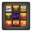

# Concept Board Creator 

**Concept Board Creator** is a workflow-optimization Unreal Engine tool designed to bridge the gap between creative reference and 3D environment staging. Built for Virtual Art Departments (VAD) and Virtual Production crews, it automates the asset ingestion process—instantly transforming 2D reference into organized, metadata-aware 3D mood boards . By eliminating the manual overhead of material instancing and aspect-ratio scaling, it allows Art Directors and Leads to focus on creative spatial relationships rather than technical scene setup.

 
*Load your textures, set your grid, and generate organized reference boards in seconds.*

---

## 🚀 The Concept
During rapid pre-visualization and VAD sprints, the transition from 2D reference to 3D space is a significant bottleneck. Manually creating planes, generating material instances, and correcting for aspect-ratio stretching are low-value, repetitive tasks that stifle creative momentum. Concept Board Creator solves this by providing a standardized, "one-click" pipeline for reference ingestion, ensuring that technical consistency is maintained without manual intervention. 
**Concept Board Creator** handles the heavy lifting by:

1. **Automating Materials:** It checks if a texture already has a dedicated material instance. If not, it generates one from a high-quality unlit master material (with exposed desaturation and emissive parameters) and saves it alongside your texture.
2. **Smart Layouts:** It calculates the correct aspect ratio for every image and organizes them into a clean grid based on your "Max Images Per Row" settings.
3. **Flexible Spawning:** You can spawn boards directly in front of your current viewport camera or at a specific world location, all parented to a single actor for easy movement and rotation.

---

## ✨ Key Features

* **One-Click Material Generation:** Automatically generates and assigns high-quality Material Instances with unlit, desaturatable, and emissive properties.
* **Asset Relationship Mapping:** Performs an audit for existing Material Instances before generation, preventing asset redundancy and maintaining pipeline hygiene.
* **Parameter Exposure:** Dynamically creates instances with exposed look-development controls, allowing for rapid global or local adjustments to emissive and desaturation values across the board. 
* **Aspect Ratio Awareness:** Automatically calculates and applies non-destructive scaling based on source texture metadata to eliminate image distortion.
* **Integrated Backing:** Generates a backing panel to provide visual organization and spatial context for custom layouts.
* **Customizable Spacing:** Provides granular UI controls for X and Z padding to define optimal viewing density.
* **World/Camera Alignment:** Toggle between spawning assets at the world origin or snapping to the current viewport perspective for instant visualization.
* **Encapsulated Actor Hierarchy:** Parents all components to a single organizational actor, providing a unified pivot for streamlined spatial manipulation and a clean Outliner structure.

---

## 📖 Quick Start Guide

1. **Launch the Tool:** Right-click `EUW_ConceptBoardCreator` and select **Run Editor Utility Widget**.
2. **Load Textures:** Add your reference images to the **Textures** array in the UI.
3. **Configure Layout:**
    * Set your **Image Scale** and **Max Images Per Row**.
    * Adjust **XSpacing** and **ZSpacing** to define the gaps between frames.
    * Set the **Backing Border** size to adjust the frame of your board.
4. **Choose Location:** Check **Spawn Infront Camera** if you want the board to appear where you are currently looking.
5. **Generate:** Click **Create Board**. The tool will generate the parent actor, the planes, the materials, and the backing.
    * *Note: To update a board, simply delete the generated actor and click "Create Board" again. Previously created material instances will be reused automatically.*

---

## 🛠 UI Overview

| Feature | Function |
| :--- | :--- |
| **Textures Array** | List of all textures to be included on the board. |
| **Image Scale** | Master multiplier for the size of all image planes. |
| **Max Images Per Row** | Defines when the grid logic should start a new horizontal line. |
| **X/Z Spacing** | Controls the horizontal and vertical gaps between image planes. |
| **Backing Border** | Allows the user to size and adjust the border of the transparent background panel. |
| **Spawn Infront Camera** | Snaps the board's spawn location to your current viewport perspective. |

---

## 📦 Installation & Prerequisites

### Prerequisites
To use this tool, the following built-in Unreal Engine plugins must be enabled:
* **Virtual Production Utilities**
* **Blueprint Material and Texture Nodes**

### Installation
1. Download the repository and extract the files.
2. Copy the `ConceptBoardCreator` folder into your project's `Plugins` directory.
3. Restart Unreal Engine.
4. Ensure **Show Plugin Content** is enabled in your Content Browser settings to locate the widget.
5. Developed and tested for **Unreal Engine 5.7**.

---

## 🤝 Contributing
Concept Board Creator was built to streamline the art direction workflow. If you have ideas for improvements, new features, or find a bug, please open an issue or submit a pull request!
